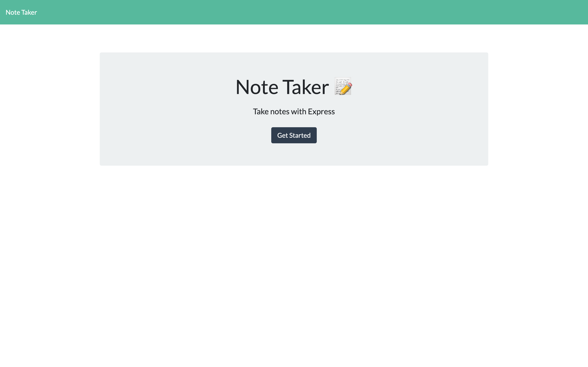
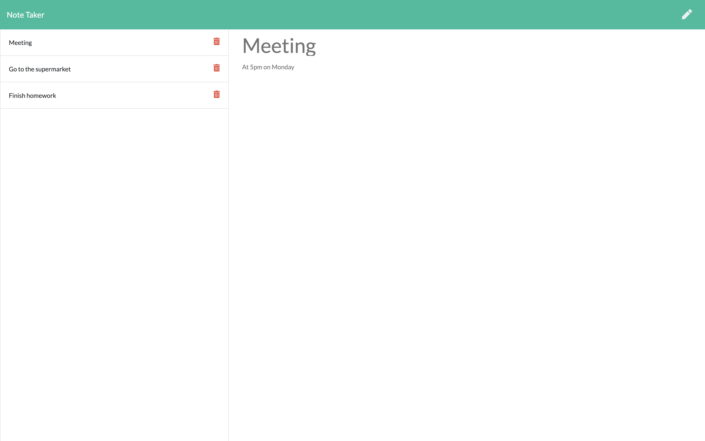

# Note Taker

  
  
  

  ## Description 
  An application that can be used to write and save notes. This application is using Express.js and saves and retrieves note data from a JSON file.

  
  

  ## Table of Contents

  * [License](#license) 
  * [Links](#links)
  * [Questions](#questions) 
  
## License
  
This application is covered under [MIT](https://choosealicense.com/licenses/mit/) License

## Links

Click [here](https://shrouded-fjord-21959.herokuapp.com/) to visit the deployed application
  
## Questions
Please feel free to reach out with any questions via [email](mailto:samersaemeldahr@gmail.com) or [GitHub](https://www.github.com/samersaemeldahr)